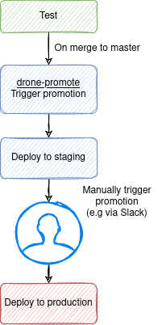

# drone-promote

A plugin which triggers downstream promotion.

It requires you to set a secret for your Drone setup as `drone_token`.

```sh
DRONE_SERVER=https://drone.myorg.dev DRONE_TOKEN=x drone orgsecret add my-org drone_token x --allow-pull-request
```

### Example workflow

This allows one pipeline to trigger another pipeline - typically used for
deployments. In a common multi-environment setup you usually want a merge to
master to deploy to staging, but keep deployments to production manual. The
image describes the workflow configured in the yaml snippet below.

<p align="center">
  
</p>

```yaml
---
kind: pipeline
type: docker
name: test
trigger:
  event:
    exclude:
      - promote
      - rollback
steps:
  - name: test
    image: python:3.9.1
    commands:
      - pytest .

---
kind: pipeline
type: docker
name: trigger-staging-deploy
depends_on:
  - test
trigger:
  branch:
    - master
  event:
    - push
steps:
  - name: promote-staging
    image: danihodovic/drone-promote
    settings:
      drone_token:
        from_secret: drone_token
      target: staging

---
kind: pipeline
type: docker
name: deploy-staging
trigger:
  event:
    - promote
  target:
    - staging
steps:
  - name: deploy
    image: danihodovic/ansible
    commands:
      - ansible-playbook deploy.yml -i environments/staging

---
kind: pipeline
type: docker
name: deploy-production
trigger:
  event:
    - promote
  target:
    - production
steps:
  - name: deploy
    image: danihodovic/ansible
    commands:
      - ansible-playbook deploy.yml -i environments/production
```
